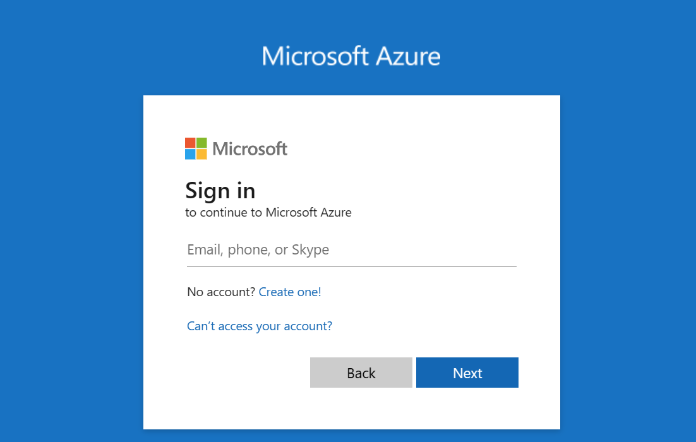
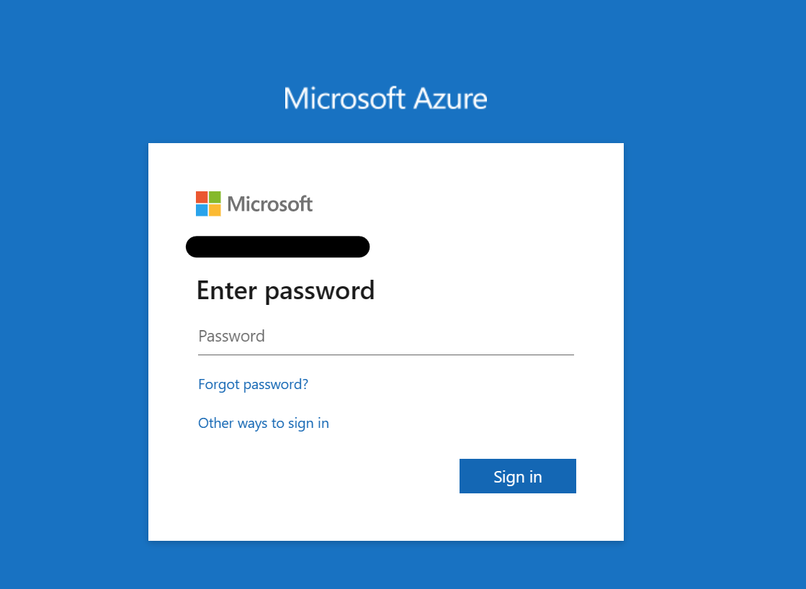
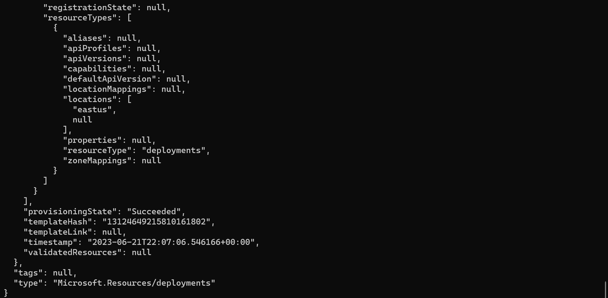
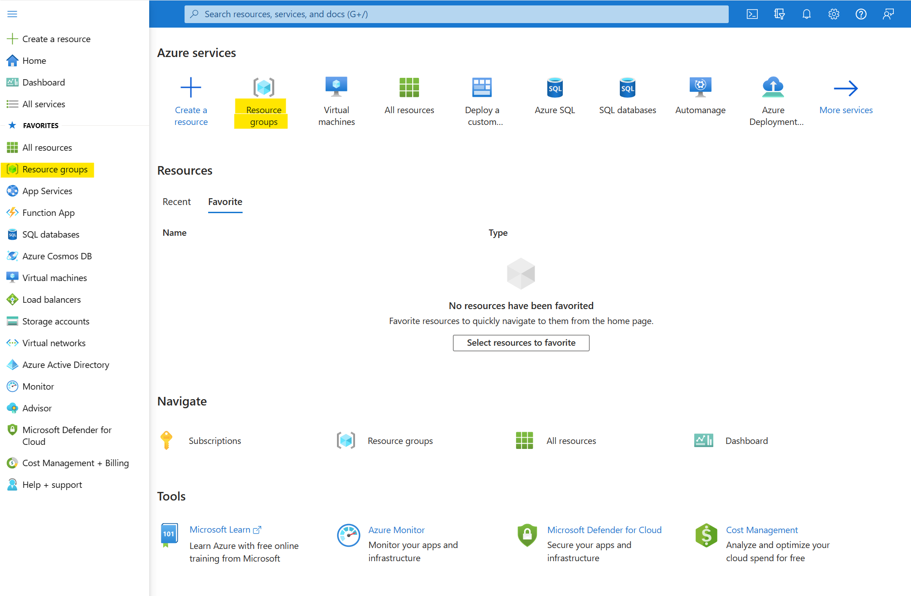
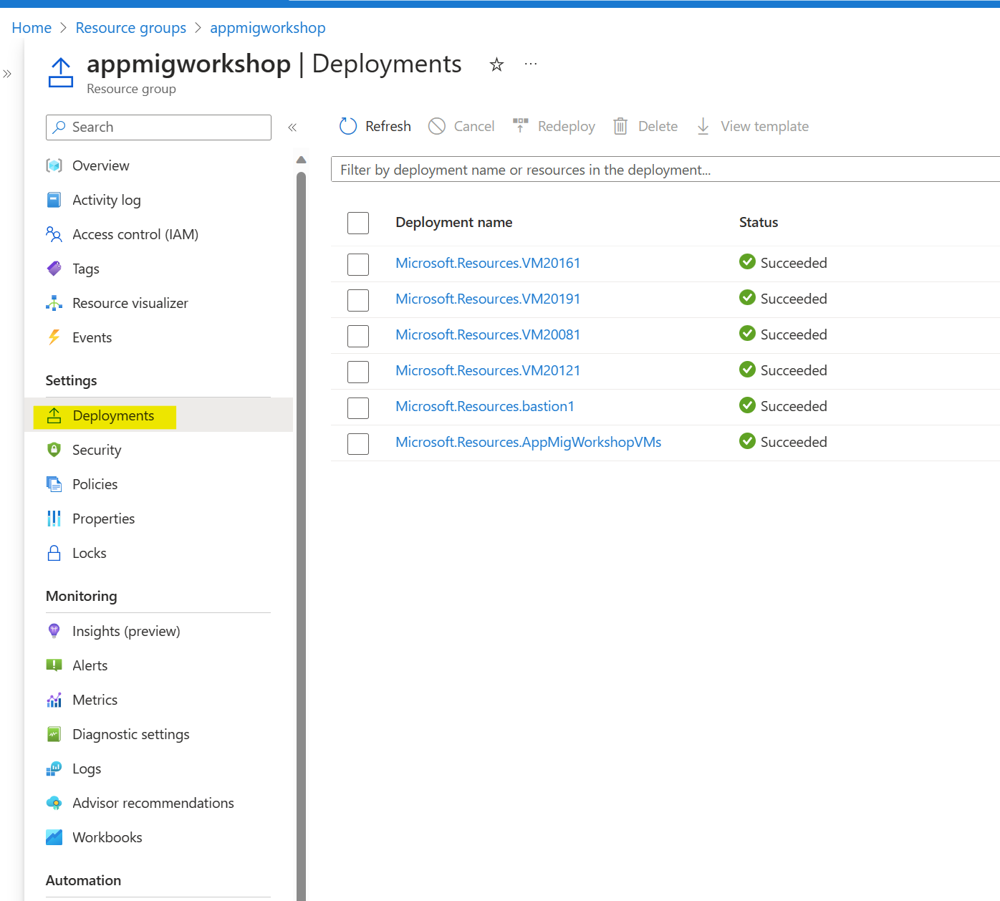
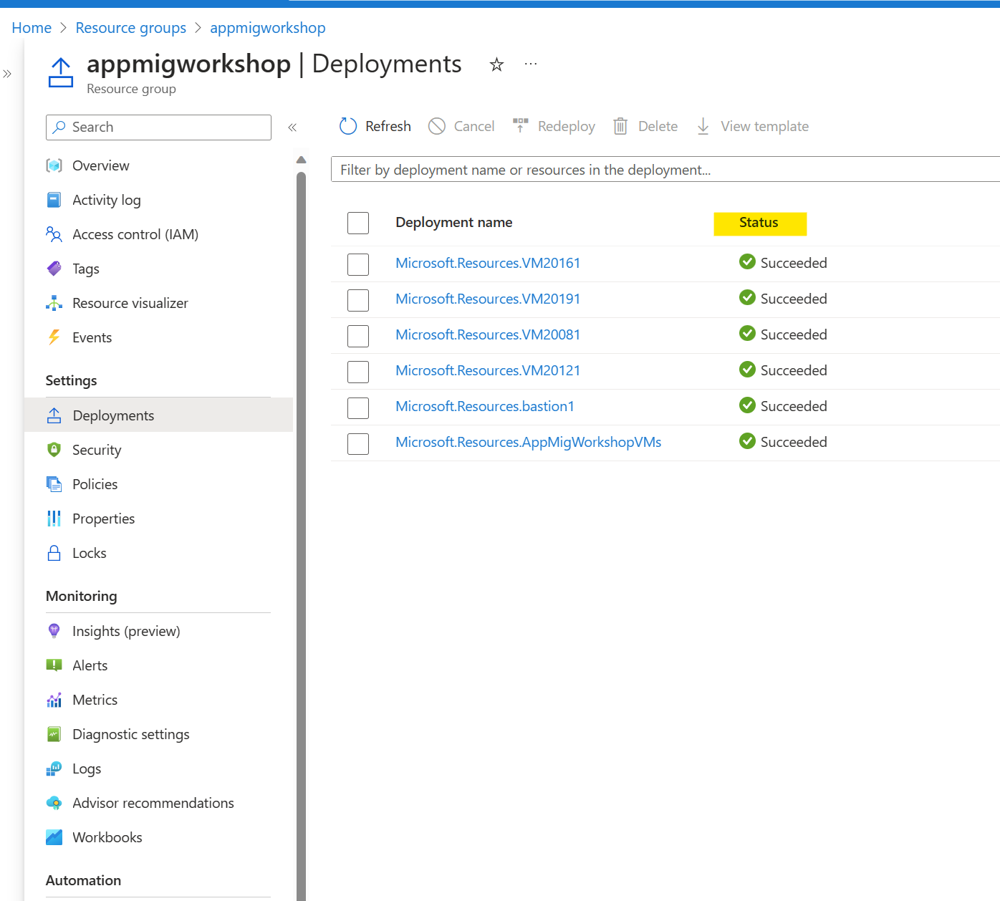

# Setting up the source environment using Resource Manager Templates

## Overview

In this lab, you will deploy a pre-built environment that you will use for the labs. The automated template will create 4 environments. Here is what is deployed:

## Applications
* Time tracker.  a .NET framework 3.5 web application with a SQL backend running on IIS7
* Jobs. a .NET framework 3.5 web application with a SQL backend running on IIS7
* Classifieds.  a .NET framework 3.5 web application with a SQL backend running on IIS7
* IBuySpy. A modernized webapp utilizing .Net4.8 and a SQL backend.

## Source environment
* Azure Resource group / Azure Vnet/Subnets / Azure Storage Account configured to emulate a customer "on-prem" environment
* 1 Windows Server 2022 VM with Active Directory installed and configured (under development - coming in next version)
* 1 Windows Server 2019 VM with SQL 2022 and IIS installed and configured with the above apps utilizing local accounts
* 1 Windows Server 2016 VM with SQL 2017 and IIS installed and configured with the above apps utilizing local accounts
* 1 Windows Server 2012 VM with SQL 2014 and IIS installed and configured with the above apps utilizing local accounts
* 1 Windows Server 2008R2 VM with SQL 2008 and IIS installed and configured with the above apps utilizing local accounts

## Target environment

* Azure Kubernetes service with Hybrid Networking and windows containers
* Azure Container Registry
* Azure Keyvault
* 4 Azure SQL databases
* 1 Windows Server 2022 VM that will act as a domain controller
* Point-to-Point VPN connectivity (simulated using Vnet Pairing for this exercise)

## Prerequisites

* An active Azure Subscription
* You are contributor at the subscription level

## Exercises

This hands-on-lab has the following exercises:

1. [Exercise 1: Opening Cloud Shell for the first time](#ex1)
1. [Exercise 2: Downloading the materials to the Cloud Shell environment](#ex2)
1. [Exercise 3: Deployment of Azure resources](#ex3)
1. [Exercise 4: Monitoring your deployment](#ex4)
1. [Exercise 5: Set up your Visual Studio online account](#ex5)

### Exercise 1: Opening Cloud Shell for the first time<a name="ex1"></a>

----

1. Open your browser and go to <a href="https://shell.azure.com" target="_new">https://shell.azure.com</a>

1. Sign on with `Microsoft Account` or `Work or School Account` associated with your Azure subscription

    

    

1. If you have access to more than one subscription, Select the Azure directory that is associated with your Azure subscription

1. If this is the first time you accessed the Cloud Shell, `Select` "PowerShell (Windows)" when asked which shell to use.

    

    > Note: If this is not the first time and it is the "Bash" shell that starts, please click in the dropdown box that shows "Bash" and select "PowerShell" instead.

1. If you have at least contributor rights at subscription level, please select which subscription you would like the initialization process to create a storage account and click "Create storage" button.

    

1. You should see a command prompt like this one:

    

### Exercise 2: Downloading artifacts to the Cloud Shell environment<a name="ex2"></a>

----

1. If not already open, open your browser and navigate to <a href="https://shell.azure.com" target="_new">https://shell.azure.com</a>. Proceed with authentication if needed.

1. The Azure Cloud Shell persists its data on a mapped folder to Azure Files service. Change directories to `C:\Users\ContainerAdministrator\CloudDrive` with

    ```powershell
    cd C:\Users\ContainerAdministrator\CloudDrive
    ```
    > If you need to delete the directory and start over run the following:
    ```powershell
    Remove-Item .\AppMigrationWorkshop\ -Recurse -Force
    ```
1. Clone the repository from its source

    ```powershell
    git clone https://github.com/Azure-Samples/LegacyDotNetAppMigrationWorkshop.git
    ```

### Exercise 3: Deployment of Azure resources<a name="ex3"></a>

----

In the automated deployment, we are using Azure Bicep to configure the virtual machines. 

1. If not already open, open your browser and navigate to <a href="https://shell.azure.com" target="_new">https://shell.azure.com</a>. Proceed with Authentication if needed.

1. Change the current folder to the location of cloned files

    ```powershell
    cd C:\Users\ContainerAdministrator\CloudDrive\AppMigrationWorkshop\Shared\IaaS\Bicep
    ```

2. Set the environment variable for the region you wish to deploy to, and run the deployment to build thesource environment.

    ```powershell
    Set-Variable -Name 'Location' -Value 'EastUS'
    az deployment sub create --location $Location --template-file main.bicep
    ```
    
### Exercise 4: Monitoring your deployment<a name="ex4"></a>

----
Although you can monitor your deployment from a PowerShell command prompt without any issues, CloudShell has a fixed timeout of **20 minutes**, if your deployment takes more than it to complete (our case, this deployment takes approximately 35 minutes) 

You will see the following message:

  

Since CloudShell is based on containers, when you reconnect, a new session will be presented to you and the deployment will be lost.

As mentioned before, if your deployment was executed from a PowerShell command prompt in a Virtual Machine or your own physical computer, it will not timeout and you will see the result of the deployment like this one:

  

The idea of this exercise is to show you how to monitor a deployment, that is independent from your deployment method (PowerShell command prompt, Azure CLI, Visual Studio, CloudShell, SDK, etc.). One method is through the Resource Group's blade's Deployment property.

1. Go to the Azure Portal (http://portal.azure.com)

2. In the portal, in the left navigation pane, click `Resource Groups`

    

3. From the Resource Group list, select the one deployed in HOL 1 (e.g. AppModernization-RG)

    

4. From the Resource Group blade, there is a left menu item list, click on `Deployments`

    

5. This will list all deployments executed and being executed, there is a column with the status of the deployment.

    


## Summary

In this hands-on lab, you learned how to:

* Use the Azure Cloud Shell
* Deploy Azure resources from an automated template
* Log on to the Azure Portal
* Use Deployment blade item of the Resource Group to monitor a deployment

----

Copyright 2023 Microsoft Corporation. All rights reserved. Except where otherwise noted, these materials are licensed under the terms of the MIT License. You may use them according to the license as is most appropriate for your project. The terms of this license can be found at https://opensource.org/licenses/MIT.

