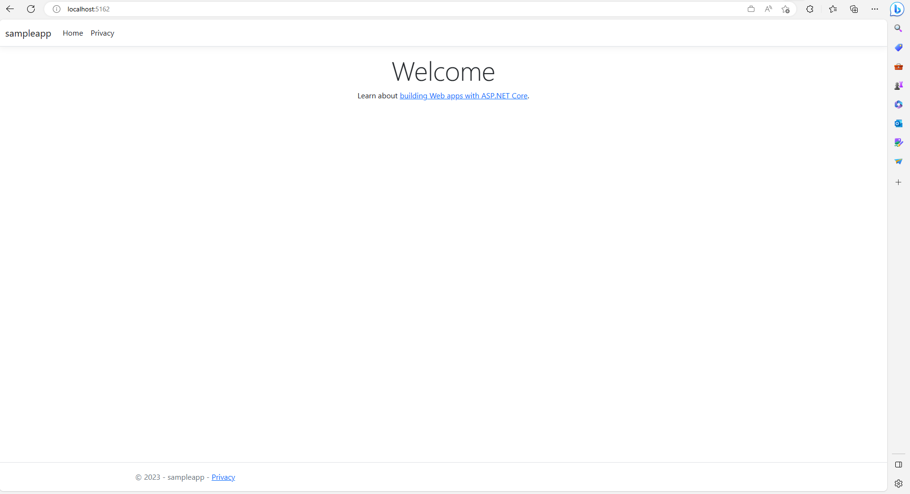

# DevOps with Azure App Service

## Overview

In this lab, you will learn how to:

* Create a sample application and configure it for Continuous Integration
* Create infrastructure as code
* Create a CI/CD pipeline
* Deploy the application to Azure

## Prerequisites

> NOTE: This HoL does _not_ depend on other modules to be completed. You can use your personal machine to complete this lab, but we recommend you use the jumpbox deployed in the previous HoL. 

* An Azure subscription are required for the completion of the lab.
* Create a repository in GitHub
* .NET 7.0 installed on your development machine. Use [https://www.microsoft.com/net/download/windows](https://www.microsoft.com/net/download/windows). We recommend you complete this HOL on the jumpbox created in the previous HOL because it is a known environment and it has .NET 7.0 pre-installed. 

## Exercises

This hands-on-lab has the following exercises:

- [Exercise 0: Setup Environment](#ex0)
- [Exercise 1: Create an Application](#ex1)
- [Exercise 2: Create the Environment](#ex2)
- [Exercise 3: Create the CI/CD Pipeline](#ex3)

### Exercise 0: Setup Environment<a name="ex0"></a>
1. If not already connected, connect to the jump box using Bastion via [RDP](https://learn.microsoft.com/azure/bastion/bastion-connect-vm-rdp-windows) or [SSH](https://learn.microsoft.com/en-us/azure/bastion/bastion-connect-vm-ssh-windows). See [HOL 1](../01-setup/)
2. Login into your GitHub account. Create a new repository and clone it to your jumpbox. 
    ```bash
    git clone <Your GitHub repo URL>
    ```
### Exercise 1: Create an Application<a name="ex1"></a>

For the purpose of this lab, we are going to create a .NET 7.0 application. You will do this from the jump box created in the previous step. 

1. If not already connected, connect to the jump box using Bastion via [RDP](https://learn.microsoft.com/azure/bastion/bastion-connect-vm-rdp-windows) or [SSH](https://learn.microsoft.com/en-us/azure/bastion/bastion-connect-vm-ssh-windows). See [HOL 1](../01-setup/)

2. Ensure that you have downloaded .NET on the machine [Download .NET 7.0](https://www.microsoft.com/net/download/thank-you/dotnet-sdk-2.1.200-windows-x64-installer)

3. Launch a PowerShell terminal

4. Use the `dotnet` command below to create a new MVC application, restore dependencies, build, and run it.

    ```powershell
    cd <Your GitHub Repository Name>
    md dotnetapp
    cd dotnetapp
    dotnet new mvc -f net7.0
    dotnet restore
    dotnet build
    dotnet run
    ```

5. The web app will be running on the localhost. Check the Powershell terminal output for the specific URL. It should look like the screenshot below.

    
6. Stop running the app locally by doing ```Ctrl + C``` in the PowerShell terminal. 
   
Before adding the application files to the repository, we will define files that we don't want to track in the repo.

1. Create a file called `.gitignore` in the root of the directory by running the following command:
   ```powershell
   cd ..
   dotnet new gitignore
   ```

2. The code below will add all the files to track and commit them to your GitHub repo. From the root directory of the project:

      ```bash
      git add -A
      git commit -am "feat: Add application files"
      git push -u origin --all
      ```

### Exercise 2: Create the Environment<a name="ex2"></a>

Now that we have an app we need to get the supporting infrastructure in Azure to host it. We will be using a CI/CD pipeline and want to deploy the infrastructure as  a workflow. This will be done via an Azure Resource Manager template. A wealth of Resource Manager templates can be found on the [Azure GitHub repo](https://github.com/Azure/azure-quickstart-templates).

For this HoL, we are going to use the template for [Deploying a Web App with custom deployment slots](https://github.com/Azure/azure-quickstart-templates/tree/master/quickstarts/microsoft.web/webapp-custom-deployment-slots).

> Note: While this template has a _"Deploy to Azure"_ button, we will be using it in a CI/CD pipeline.

1. Open a Git Bash terminal. 
2. Change into the root of your GitHub repository. 
3. Create a new branch called "feature/add-workflow-infra" by running the following command:
**   Before executing this command, ensure you are on the main branch and have fetched the origin.
**   
  ```bash
   git fetch 
   git checkout -b feature/add-infra-support
   ```
4. Create a folder, .github/workflows, in your GitHub repo with your application. 
5. Locate the [App Service Environment Workflow](./.github/workflows/build-app-service-environment.yaml) and the [App Service Destroy Environment Workflow](./.github/workflows/destroy-app-service-environment.yaml) in this repo. Place the files in the .github/workflows folder you created  in the previous step.
6. The code below will add all the files to track and commit them to your GitHub repo. From the root directory of the project:

      ```bash
      git add -A
      git commit -am "feat: Add infra files and workflow"
      git push --set-upstream origin feature/add-infra-support
      ```
7. Submit a Pull Request to main from your branch through GitHub. Once the Pull Request has been created, hit Merge, type a meaningful commit message and merge your branch. 
8.  [Register an app in the Azure portal for your application](https://learn.microsoft.com/en-us/azure/active-directory/develop/quickstart-register-app#register-an-application)
9.  Give you application [Federated credentials](https://learn.microsoft.com/azure/active-directory/workload-identities/workload-identity-federation-create-trust?pivots=identity-wif-apps-methods-azp#github-actions). Federated credentials allow certain services such as GitHub to have permission to deploy Azure resources without having to specify a client secret. It sends a claim to Azure which then returns a token. 

Use the following values for the credential:
  - Organization = <Your GitHub Organization Name>
  - Repository = <Your Repository Name>
  - Entity Type = branch
  - Github branch name = main
  - Name = GitHubDeployMain
    
10.  Create the following secrets in your repository with the corresponding values from the application you just created:
    - AZURE_CLIENT_ID = <Application Client Id>
    - AZURE_TENANT_ID = <Application Tenant Id>
    - AZURE_SUBSCRIPTION_ID = <Your Azure Subscription Id>
11.  Create the following variables in your repository:
    - AZURE_RG = <Choose a name for the resource group>
    - LOCATION = <Choose a location for your resources>
12.  Navigate to the *Actions* tab and locate your workflow on the left sidebar (Build and deploy Azure App Service Environment).
13.  Click the drop dropdown that says *Run workflow* and click *Run workflow*
   

Once your workflow completes successfully, you will see the following resources created in your resource group:
- App Service Plan
- App Service
- 4 Deployment slots (Preview, Dev, QA, and UAT)


### Exercise 3: Create the App Service Deployment Pipeline <a name="ex3"></a>

### Setup workflow

With the code in GitHub, the CI/CD pipeline needs to be configured. For this lab, we will be creating a GitHub workflow to deploy to Azure App Service. The workflow has already been written for you and will need to be copied from this repository to your GitHub repository. 

1. For this workflow, you will need to one secret to your GitHub repository for the App Service Publish Profile. Navigate to your App Service in the Portal and download the publish profile. Copy the contents into a new secret in your GitHub repository. 
2. Create a new branch called "feature/add-workflow-app-service" by running the following command:
**   Before executing this command, ensure you are on the main branch and have fetched the origin.
**   
  ```bash
   git fetch 
   git checkout -b feature/add-workflow-app-service
   ```
1. Locate the [App Service Deployment Pipeline](./.github/workflows/deploy-app-service.yml) in this repo. Place the file in the .github/workflows folder you created  in the previous exercise.
2. Run the following commands to commit your changes to your branch 
3. Submit a Pull Request to main from your branch through GitHub. Once the Pull Request has been created, hit Merge, type a meaningful commit message and merge your branch. 

After completing the above steps, naviagte to the *Actions* tab at the top of the screen. You will see a run has kicked off with your newly added workflow. Wait a couple of minutes after the workflow has completed and proceed to the next section. 

### Exercise 4:  Test<a name="ex4"></a>

1. With the successful deployment, open your Azure Portal and navigate to the WebApp.

1. Click on the url to launch the site.

### Cleanup

1. Navigate to the *Actions* tab in your GitHub repository and find the workflow named *Destroy Azure App Service Environment*. 
2. Click *Run workflow*. This workflow will destroy the infrastructure environment and your application running on the App Service. 

## References

[How to Create a GitHub Workflow]()

[Workflows with Azure App Service]()

## Summary

In this hands-on lab, you learned how to:

* Create a GitHub workflow 
* Configure source control integration for continuous integration
* Deploy a .NET 7.0 application to Azure App Service with CI/CD

----

Copyright 2023 Microsoft Corporation. All rights reserved. Except where otherwise noted, these materials are licensed under the terms of the MIT License. You may use them according to the license as is most appropriate for your project. The terms of this license can be found at https://opensource.org/licenses/MIT.
